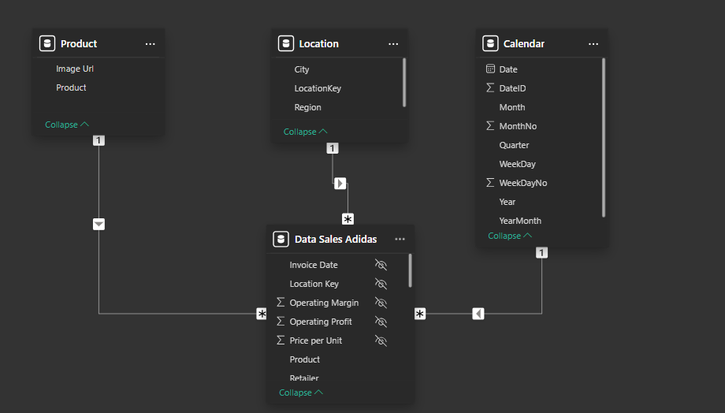
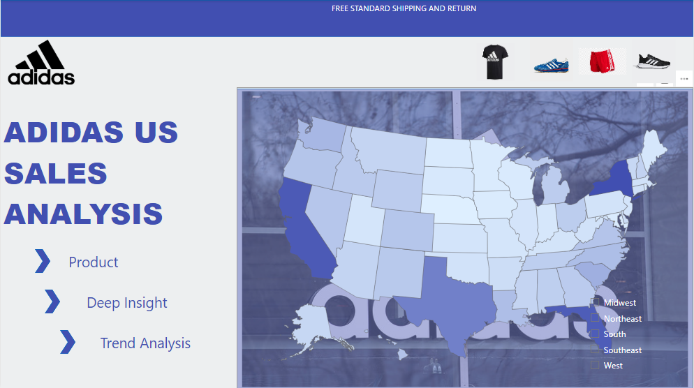
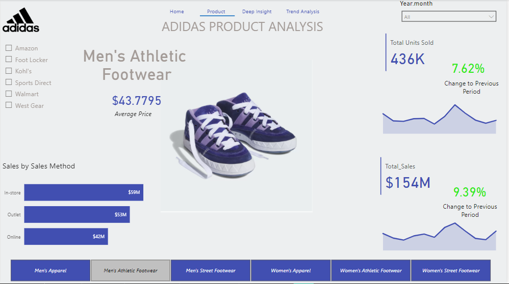
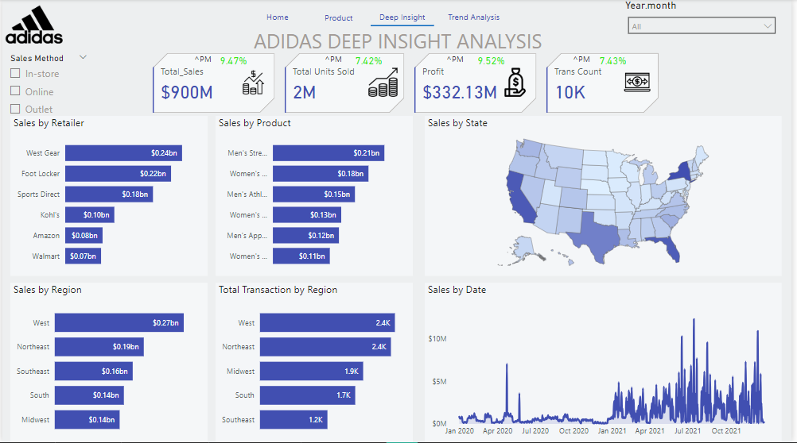
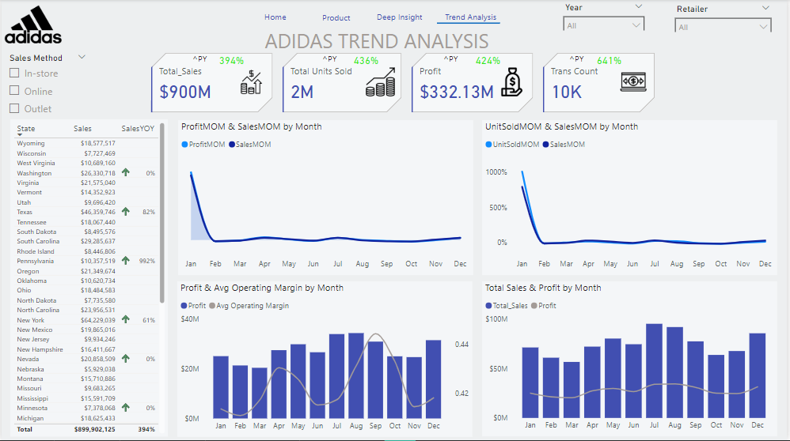

# Adidas_Sales_Report

## Introduction
This is a PowerBi report on Adidas' sales analysis. The project is to analyze sales between 2020 and 2021 and derive insights to make data-driven decisions for the coming years.
**_Note_:** The dataset is extracted from Kaggle to demonstrate my PowerBi skills. 

## Problem Statement
- What are the total sales, profit, total units sold, and the number of transactions? 
- What are the sales by state, region, product, retailer, month, and sales method?
- What is the sales year to year and month to month?
- What is the profit year to year and month to month, as well as the units sold and transaction year to year and month to month?

## Skills Demonstrated
The following PowerBi features were incorporated: PowerQuery, DAX, Measures, Buttons, Page navigation, Tooltips, and Modelling. 

## Modelling
This is an automatically derived relationship. The Calendar table was created using the DAX function. 

The model is a star schema. There are 3 dimension tables and 1 fact table. The dimension tables are all joined to the fact table by a one-to-many relationship.

## Visualization
The report comprises 4 pages: 
1. Home page
2. Product
3. Deep Insight
4. Trend Analysis

You can interact with the report [here](https://app.powerbi.com/view?r=eyJrIjoiMWJkMDExOWEtNjMxYy00NjI4LWJhZTEtMTZhMTY4YTA3Y2FkIiwidCI6IjNkMjc1YjJkLTY3YjUtNDI2Yi1iY2M3LWE2OTg0YzIwMzFkYyJ9)

Features:
- Hamburger is a button to display each page. 
- The three tabs are buttons with a hovering effect and each navigates to the page with a similar name.

## Analysis
### Product Insight:

The six products have low online sales compared to in-store sales. 

### Deep Insight:

July and August generated the highest sales and Units sold. Monthly sales also rise and fall intermittently.

### Trend Analysis:

There was a great change in sales for each product in 2021 compared to the previous year, 2020.

## Conclusion:
- There was a total of 900 Million dollars in sales with 332.13 Million dollars in profit for the two years.

## Recommendation: 
For a deep dive into the analytics, the datasets of the previous years will be required for comparison and data-driven decision-making.

